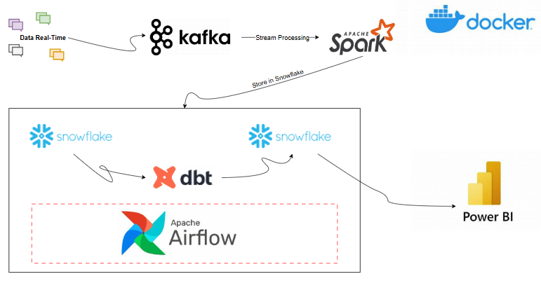
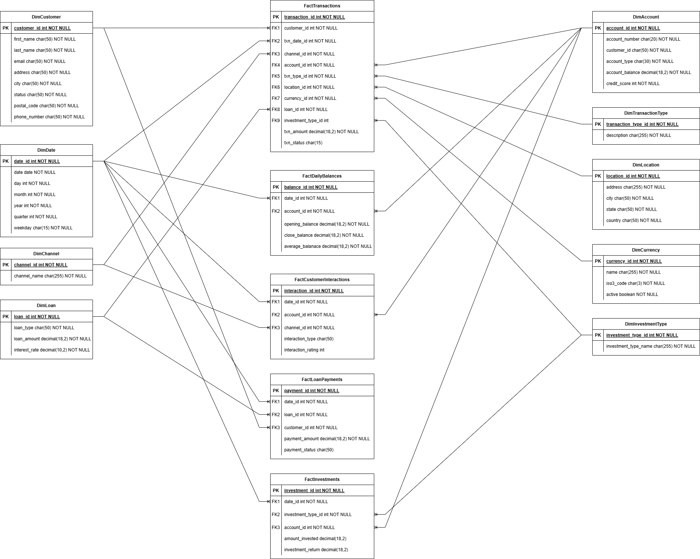
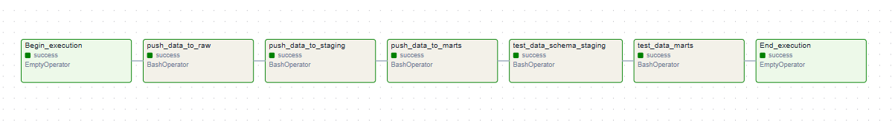
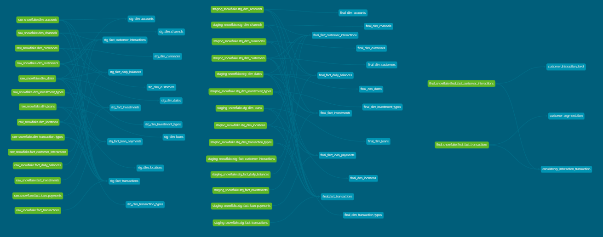

# Bank-ETL-Pipeline

### 🚀 1.DESCRIPTION
In this project, I build a data pipeline with data sent in real time and use DBT to process then store in Snowflake.

### 🧐 2.ARCHITECTURE

### ⭐️ 3.DATA WAREHOUSE

### 🔥 4.SET UP AND RUN

Due to hardware limitations in my computer, in this project I built kafka and airflow at the same time. First run move to the "airflow" directory and run: 

<strong>docker-compose up -d --build</strong>

After running successfully, kafka and Airflow have been built on docker. Next, we have to build the dependencies on Snowflake as follows:

- Move to the "scripts" folder and run: <strong>python run_scripts.py</strong>

Now let's start running Kafka and Airflow to send data to Snowflake and transform the data with Dbt:

- Run Apache Kafka: 
  - Di chuyển đến thu

Run: dbt compile --models staging.dimensions.stg_dim_accounts / dbt compile --models staging
Run: dbt run --models staging / dbt run --select models/staging/dimensions/stg_dim_accounts.sql

### ✅ 5.FINAL RESULT
- Data pipeline for my project

- Lineage graph in Dbt

### 🚨 6.CONCLUSION

Basically, in this project I want to focus mainly on using Dbt for data transformation because nowadays Dbt is gradually becoming a powerful tool in data processing with SQL statements.
